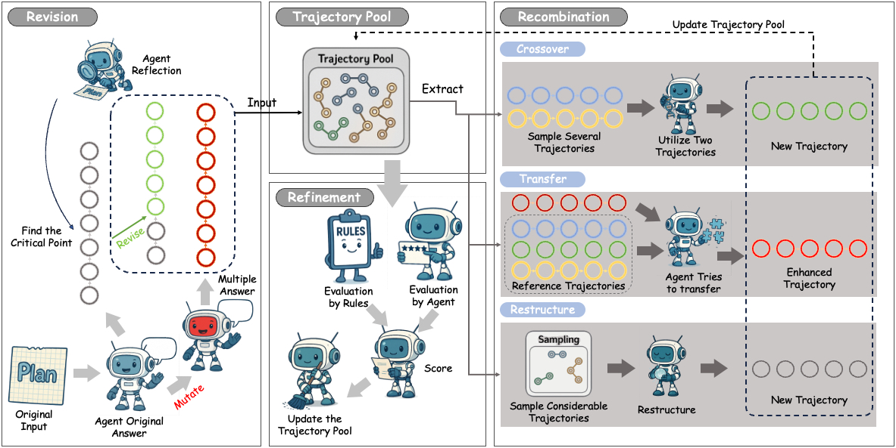
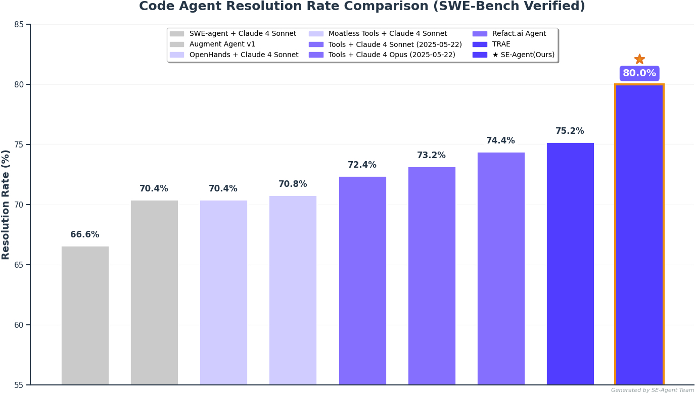
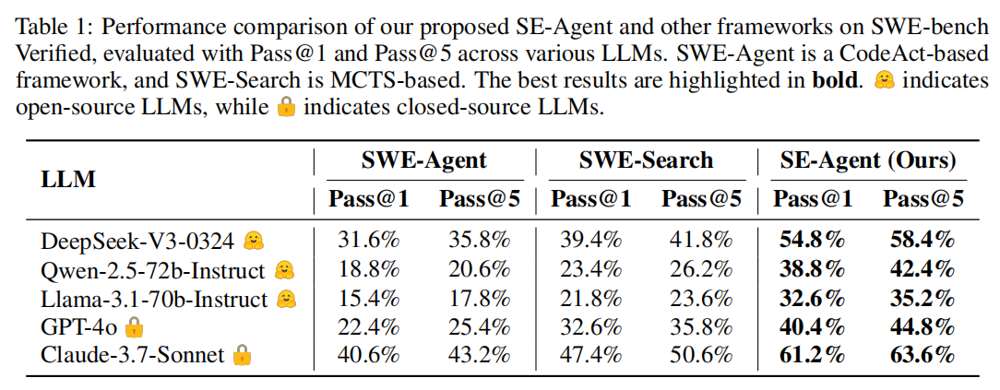

<div align="center">

<table border="0">
  <tr>
    <td></td>
    <td><h1>SE-Agent: Self-Evolution Trajectory Optimization in Multi-Step Reasoning with LLM-Based Agents</h1></td>
  </tr>
</table>

</div>

<p align="center">
  <strong>🏆 State-of-the-Art Performance on SWE-bench Verified: 80%</strong><br>
  <strong>🚀 Up to +112% Performance Gain</strong><br>
</p>

<p align="center">
  <a href="https://arxiv.org/abs/2508.02085"></a>
  <a href="https://www.swebench.com"></a>
  <a href="LICENSE"></a>
</p>

---

## 🎯 What is SE-Agent?

**SE-Agent** is a **self-evolution framework** that enables information exchange between reasoning paths through a trajectory-level evolution mechanism, breaking the cognitive limitations of single trajectories. This approach expands the search space, escapes local optima, and demonstrates emergent capabilities from collective interactions, achieving **80% Top1 performance** on **SWE-bench Verified**, truly realizing autonomous evolution for LLM-based agents in complex reasoning tasks.

<div align="center">

</div>

### 📊 Performance Results

#### 🏆 SWE-bench Verified Evaluation: State-of-the-Art Performance!
SE-Agent ranks **Top1 among open-source frameworks** on SWE-bench Verified.

<div align="center">

</div>

#### ✨ Performance Comparison: Leading with Significant Gains!
SE-Agent gain significant gains on SWE-bench Verified **across various open-source/closed-source LLMs**.

<div align="center">

</div>

## ⚡ Quick Start

Get SE-Agent running in **30 seconds**:

```bash
# 1. Clone and install
git clone https://github.com/JARVIS-Xs/SE-Agent.git
cd SE-Agent
pip install -e .

# 2. Set up API key
echo "DEEPSEEK_API_KEY=your_key_here" > .env

# 3. Run demo (no API calls)
python SE/basic_run.py --mode demo

# 4. Run your first experiment
python SE/basic_run.py --mode execute
```

**Expected Output:**
```text
✅ SE-Agent initialized successfully
🔄 Starting self-evolution with 3 iterations  
```

> 💡 **Need detailed setup?** See [📦 Installation & Configuration](#-installation--configuration) below

## 🧠 How SE-Agent Works

SE-Agent implements **three core self-evolution operations** that transform how agents approach problem-solving:

### 🔄 Three Core Operations

#### 1. **🔧 Revision** - *Failure-Driven Strategy Generation*
Analyzes individual failed trajectories through **deep self-reflection** and **targeted improvement**. Goes beyond simple retries by identifying fundamental approach limitations and creating **architecturally orthogonal** problem-solving paradigms. This involves analyzing a single trajectory to identify errors, inefficiencies, or conceptual blind spots, then prompting the agent to generate completely different solution approaches that address these specific limitations.

#### 2. **🤝 Recombination** - *Cross-Trajectory Knowledge Synthesis*  
Creates novel trajectories by **intelligently combining strengths** from multiple existing solution paths. This is where **cross-trajectory inspiration** primarily occurs - SE-Agent intelligently selects high-performing segments from different trajectories and merges them to construct superior approaches. The process explicitly leverages the **interdependence of various attempts**, allowing successes in one area to compensate for shortcomings in others, enabling **1+1>2** synergistic effects that transcend individual trajectory limitations.

#### 3. **✨ Refinement** - *Risk-Aware Trajectory Optimization*
Optimizes promising trajectories by **eliminating redundancies** and **enhancing efficiency** using insights from the entire trajectory pool. After new trajectories are formed, this step further hones them by removing unnecessary steps, streamlining action sequences, and incorporating **risk-aware guidance** that prevents systematic blind spots and failure modes learned from the collective exploration history.

<div align="center">

</div>


## 💻 Usage Examples

### Basic Self-Evolution Experiment

```python
# Configure multi-iteration strategy
strategy_config = {
    "iterations": [
        {"base_config": "baseline", "operator": None},
        {"base_config": "enhanced", "operator": "alternative_strategy"}, 
        {"base_config": "enhanced", "operator": "crossover"}
    ]
}
```

Run self-evolution process

```bash
python SE/basic_run.py --config SE/configs/se_configs/experiment.yaml --mode execute
```

### Custom Operator Development

SE-Agent supports flexible operator extensibility for creating custom evolution strategies:

```python
from SE.operators import TemplateOperator, register_operator

class MyEvolutionOperator(TemplateOperator):
    def _generate_content(self, instance_info, problem_description, trajectory_data):
        # Implement your custom evolution strategy
        return "Your generated strategy content"

# Register and use
register_operator("my_operator", MyEvolutionOperator)
```

> 📖 **Complete Operator Development Guide:** See [SE/operators.md](SE/operators.md) for comprehensive operator development documentation including architecture, examples, and best practices

### Batch Processing

```bash
# Process multiple SWE-bench instances
sweagent run-batch \
  --config config/default.yaml \
  --agent.model.name deepseek/deepseek-chat \
  --instances.subset verified \
  --instances.slice :10
```

## 📚 Documentation

SE-Agent provides comprehensive documentation for different use cases:

| Document | Purpose | Audience |
|----------|---------|----------|
| [SE/README.md](SE/README.md) | SE Framework detailed guide | Developers & Researchers |
| [SE/operators.md](SE/operators.md) | Operator development guide | Advanced developers |
| [instruction.md](instruction.md) | Usage instructions & configuration | All users |

### Quick Navigation

- **🚀 Getting Started:** Follow the [Quick Start](#-quick-start) above
- **⚙️ Configuration:** See [instruction.md](instruction.md) for detailed setup
- **🔧 Development:** Check [SE/README.md](SE/README.md) for framework internals
- **🛠️ Custom Operators:** Refer to [SE/operators.md](SE/operators.md) for operator development

## 🏗️ Architecture Overview

SE-Agent consists of **three main components** working in harmony:

```text
📁 SE-Agent Architecture
├── 🧠 SE Framework (SE/)
│   ├── Multi-iteration experiment orchestration
│   ├── Self-evolution operators (Revision, Recombination, Refinement)
│   └── Intelligent trajectory processing & compression
├── 🔧 SWE-Agent Base (sweagent/)  
│   ├── LLM agent implementations
│   ├── Environment interaction layer
│   └── Tool execution system
└── 📊 Trajectory System
    ├── Compressed trajectory storage (.tra files - 80% size reduction)
    ├── Cross-iteration knowledge accumulation
    └── LLM-driven trajectory analysis & summarization
```


## 📦 Installation & Configuration

### Installation Options

**Option 1: Pip Installation (Recommended)**
```bash
git clone https://github.com/JARVIS-Xs/SE-Agent.git
cd SE-Agent
pip install -e .
```

**Option 2: Conda Environment**
```bash
git clone https://github.com/JARVIS-Xs/SE-Agent.git
cd SE-Agent
conda create -n SE python=3.12
conda activate SE
pip install -e .
```

**Verify Installation:**
```bash
sweagent --help
python SE/test/run_operator_tests.py
```

### API Key Configuration

Choose one of the following API providers:

```bash
# Create .env file
echo "DEEPSEEK_API_KEY=your_deepseek_key" > .env
# OR
echo "OPENAI_API_KEY=your_openai_key" > .env  
# OR
echo "ANTHROPIC_API_KEY=your_anthropic_key" > .env
```

> 📋 **Detailed Configuration Guide:** See [instruction.md](instruction.md) for comprehensive configuration options, strategy parameters, and execution workflows

## 🧪 Testing & Development

### Quick Testing

```bash
# Run all tests
pytest

# Run SE framework tests  
python SE/test/run_operator_tests.py

# Demo mode (no API calls)
python SE/basic_run.py --mode demo

# Code formatting
ruff check .
ruff format .
```

### Development Resources

- **🔧 SE Framework Guide:** [SE/README.md](SE/README.md) - Comprehensive SE framework documentation with testing, development workflow, and project structure
- **⚙️ Operator Development:** [SE/operators.md](SE/operators.md) - Complete operator development guide with architecture details and examples  
- **📖 Usage Instructions:** [instruction.md](instruction.md) - Detailed usage instructions, configuration options, and execution strategies

### Citation

If you use SE-Agent in your research, please cite our paper:

```bibtex
@article{se-agent-2025,
  title={SE-Agent: Self-Evolution Trajectory Optimization in Multi-Step Reasoning with LLM-Based Agents},
  author={Jiaye Lin and Yifu Guo and Yuzhen Han and Sen Hu and Ziyi Ni and Licheng Wang and Mingguang Chen and Daxin Jiang and Binxing Jiao and Chen Hu and Huacan Wang},
  journal={arXiv preprint arXiv:2508.02085},
  year={2025},
  url={https://arxiv.org/abs/2508.02085}
}
```


## 📄 License

This project is licensed under the MIT License - see the [LICENSE](LICENSE) file for details.

## 🙏 Acknowledgments

We would like to thank the following projects and contributors:

- **[SWE-Agent](https://github.com/princeton-nlp/SWE-agent)** - Our foundation framework, developed by Carlos E. Jimenez, John Yang, Kilian Lieret and team
- **[SWE-bench](https://github.com/SWE-bench/SWE-bench)** - For providing the evaluation benchmark and test datasets that enable rigorous assessment of software engineering AI agents
- **[litellm](https://github.com/BerriAI/litellm)** - For unified LLM API interface support
- **Open source community** - For contributions to the advancement of software engineering AI agents

## 📞 Contact & Support

- **📧 Email**: [wanghuacan17@mails.ucas.ac.cn](mailto:wanghuacan17@mails.ucas.ac.cn)
- **🐛 Issues**: [GitHub Issues](https://github.com/JARVIS-Xs/SE-Agent/issues)
- **💬 Discussions**: [GitHub Discussions](https://github.com/JARVIS-Xs/SE-Agent/discussions)
---

<div align="center">

**⭐ If SE-Agent helps your research or projects, please give us a star! ⭐**

*Made with ❤️ by the SE-Agent Research Team*

</div>
